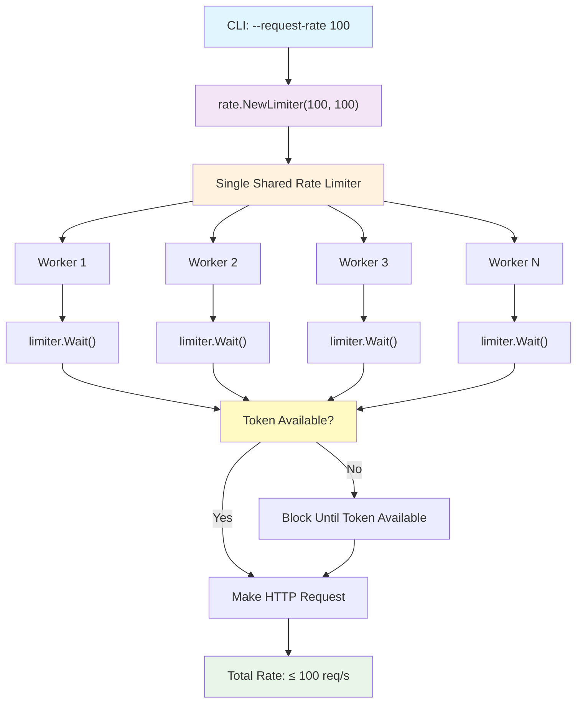

# Sitemap Crawler

A high-performance, configurable sitemap crawling tool written in Go. This tool can interpret various sitemap formats including multi-stage and multi-file sitemaps, with configurable request rates, parallel workers, custom headers, and cache verification capabilities.

## Features

- ✅ **Multi-format Support**: Handles XML sitemaps, sitemap indexes, and plain text sitemaps
- ✅ **Multi-stage Processing**: Automatically processes nested sitemap indexes
- ✅ **Configurable Performance**: Adjustable request rates and parallel workers
- ✅ **Custom Headers**: Send custom HTTP headers with each request
- ✅ **Cache Verification**: Two-phase crawling to measure cache hit/miss rates
- ✅ **Progress Tracking**: Real-time progress updates with percentage completion
- ✅ **Performance Metrics**: Comprehensive statistics including success rates and timing
- ✅ **Multiple Output Formats**: Text, JSON, and CSV output options
- ✅ **Rate Limiting**: Built-in global rate limiting to be respectful to servers
- ✅ **Intelligent Backoff**: Automatic backoff on server errors and response time degradation
- ✅ **Protection Mechanisms**: Emergency cancellation on excessive 403 errors
- ✅ **Error Handling**: Robust error handling with detailed logging

## Installation

### Prerequisites

- Go 1.23 or later
- Git

### Build from Source

```bash
# Clone the repository
git clone https://github.com/benvon/sitemap-crawler.git
cd sitemap-crawler

# Install dependencies
go mod tidy

# Build the binary
go build -o ./bin/sitemap-crawler ./cmd/crawler

# Make it executable
chmod +x ./bin/sitemap-crawler
```

### Using Go Install

```bash
go install github.com/benvon/sitemap-crawler/cmd/crawler@latest
```

## Usage

### Basic Usage

```bash
# Crawl a simple sitemap
./sitemap-crawler --sitemap-url https://example.com/sitemap.xml

# Crawl with custom configuration
./sitemap-crawler \
  --sitemap-url https://example.com/sitemap.xml \
  --max-workers 20 \
  --request-rate 200 \
  --request-timeout 30s
```

### Advanced Configuration

```bash
# Custom headers and user agent
./sitemap-crawler \
  --sitemap-url https://example.com/sitemap.xml \
  --headers "Authorization:Bearer token123" \
  --headers "X-Custom-Header:value" \
  --user-agent "MyBot/1.0"

# Cache verification mode
./sitemap-crawler \
  --sitemap-url https://example.com/sitemap.xml \
  --cache-verification-mode \
  --cache-header "X-Cache-Status" \
  --max-workers 10 \
  --request-rate 50

# Output to different formats
./sitemap-crawler \
  --sitemap-url https://example.com/sitemap.xml \
  --output-format json \
  --quiet
```

### Command Line Options

| Option | Description | Default | Required |
|--------|-------------|---------|----------|
| `--sitemap-url` | URL of the sitemap to crawl | - | ✅ Yes |
| `--max-workers` | Maximum number of parallel workers | 10 | No |
| `--request-rate` | Maximum requests per second (total across all workers) | 100 | No |
| `--request-timeout` | Request timeout | 30s | No |
| `--user-agent` | User agent string | SitemapCrawler/1.0 | No |
| `--headers` | Custom headers (format: Key:Value) | - | No |
| `--cache-verification-mode` | Enable cache verification mode | false | No |
| `--cache-header` | Header to check for cache status | X-Cache | No |
| `--output-format` | Output format (text, json, csv) | text | No |
| `--quiet` | Suppress progress output | false | No |
| `--debug` | Enable debug logging | false | No |
| `--backoff-enabled` | Enable backoff on server errors and response degradation | true | No |
| `--backoff-initial-delay` | Initial backoff delay | 1s | No |
| `--backoff-max-delay` | Maximum backoff delay | 30s | No |
| `--backoff-multiplier` | Backoff delay multiplier | 2.0 | No |
| `--response-time-degradation-threshold` | Response time degradation threshold (0.5 = 50% slower) | 0.5 | No |
| `--forbidden-error-threshold` | Number of 403 errors within window to cancel crawl | 5 | No |
| `--forbidden-error-window` | Time window for 403 error tracking | 5s | No |

### Environment Variables

You can also set configuration via environment variables with the `SITEMAP_CRAWLER_` prefix:

```bash
export SITEMAP_CRAWLER_MAX_WORKERS=20
export SITEMAP_CRAWLER_REQUEST_RATE=150
export SITEMAP_CRAWLER_REQUEST_TIMEOUT=45s
./sitemap-crawler --sitemap-url https://example.com/sitemap.xml
```

## Examples

### Example 1: Basic Sitemap Crawling

```bash
./sitemap-crawler --sitemap-url https://example.com/sitemap.xml
```

Output:
```
INFO Starting sitemap crawler
INFO Configuration loaded sitemap_url=https://example.com/sitemap.xml max_workers=10 request_rate=100 cache_mode=false
INFO Sitemap parsed successfully total_urls=150
INFO URLs filtered valid_urls=148
INFO Progress update processed=50 total=148 percentage=33.8% success_rate=96.0% avg_duration=245ms
INFO Progress update processed=100 total=148 percentage=67.6% success_rate=94.0% avg_duration=238ms
INFO Progress update processed=148 total=148 percentage=100.0% success_rate=93.9% avg_duration=241ms
INFO Crawling completed total_processed=148 total_success=139 total_errors=9 success_rate=93.9% avg_duration=241ms min_duration=89ms max_duration=1.2s total_duration=35.7s
```

### Example 2: Cache Verification Mode

```bash
./sitemap-crawler \
  --sitemap-url https://example.com/sitemap.xml \
  --cache-verification-mode \
  --cache-header "X-Cache-Status" \
  --max-workers 5 \
  --request-rate 30
```

Output:
```
INFO Starting sitemap crawler
INFO Configuration loaded sitemap_url=https://example.com/sitemap.xml max_workers=5 request_rate=30 cache_mode=true
INFO Sitemap parsed successfully total_urls=150
INFO URLs filtered valid_urls=148
INFO Running in cache verification mode
INFO Phase 1: Warming up cache
INFO Progress update processed=50 total=148 percentage=33.8% success_rate=96.0% avg_duration=245ms
INFO Phase 2: Verifying cache
INFO Progress update processed=50 total=148 percentage=33.8% success_rate=96.0% avg_duration=245ms
INFO Cache verification completed cache_hits=45 cache_misses=103 cache_hit_rate=30.4% warm_up_time=12.3s verify_time=8.7s
```

### Example 3: Custom Headers and Output Format

```bash
./sitemap-crawler \
  --sitemap-url https://example.com/sitemap.xml \
  --headers "Authorization:Bearer your-token" \
  --headers "X-API-Key:your-api-key" \
  --output-format json \
  --quiet
```

Output (JSON):
```json
{
  "timestamp": "2024-01-15T10:30:00Z",
  "total_processed": 148,
  "total_success": 139,
  "total_errors": 9,
  "success_rate": 93.9,
  "average_duration": "241ms",
  "min_duration": "89ms",
  "max_duration": "1.2s",
  "total_duration": "35.7s"
}
```

## Sitemap Format Support

### XML Sitemap Index

```xml
<?xml version="1.0" encoding="UTF-8"?>
<sitemapindex xmlns="http://www.sitemaps.org/schemas/sitemap/0.9">
  <sitemap>
    <loc>https://example.com/sitemap1.xml</loc>
    <lastmod>2024-01-01T00:00:00Z</lastmod>
  </sitemap>
  <sitemap>
    <loc>https://example.com/sitemap2.xml</loc>
    <lastmod>2024-01-02T00:00:00Z</lastmod>
  </sitemap>
</sitemapindex>
```

### XML URL Set

```xml
<?xml version="1.0" encoding="UTF-8"?>
<urlset xmlns="http://www.sitemaps.org/schemas/sitemap/0.9">
  <url>
    <loc>https://example.com/page1</loc>
    <lastmod>2024-01-01T00:00:00Z</lastmod>
    <changefreq>daily</changefreq>
    <priority>0.8</priority>
  </url>
  <url>
    <loc>https://example.com/page2</loc>
    <lastmod>2024-01-02T00:00:00Z</lastmod>
    <changefreq>weekly</changefreq>
    <priority>0.6</priority>
  </url>
</urlset>
```

### Plain Text Sitemap

```
https://example.com/page1
https://example.com/page2
https://example.com/page3
```

## Performance Considerations

- **Rate Limiting**: The tool respects the configured request rate to avoid overwhelming servers
- **Parallel Workers**: Adjust the number of workers based on your system resources and target server capacity
- **Timeout Settings**: Set appropriate timeouts for your network conditions
- **Memory Usage**: For very large sitemaps, consider processing in batches

### Rate Limiting Architecture

The crawler implements global rate limiting across all workers to ensure respectful crawling behavior. The `--request-rate` parameter caps the **total** request rate, not per-worker rate:



This design ensures that:

- Multiple workers coordinate through a shared token bucket
- Total request rate never exceeds the configured limit
- The crawler remains respectful to target servers
- Cache warming operations don't overwhelm uncached sites

### Backoff and Protection Features

The crawler includes intelligent backoff mechanisms to protect target sites and prevent overwhelming servers:

#### Server Error Backoff

- Automatically backs off when receiving 50x server errors (500, 502, 503, etc.)
- Uses exponential backoff with configurable delays and multipliers
- Resets backoff when server health improves

#### Response Time Monitoring

- Continuously monitors response times to establish baseline performance
- Triggers backoff when response times degrade by a configurable threshold (default: 50%)
- Helps detect when a site is under stress

#### Emergency Cancellation

- Monitors 403 Forbidden errors within a sliding time window
- Automatically cancels the entire crawl if too many 403s are received (default: 5 within 5 seconds)
- Prevents triggering security mechanisms or IP blocking

#### Example with Backoff Configuration

```bash
./sitemap-crawler \
  --sitemap-url https://example.com/sitemap.xml \
  --backoff-enabled \
  --backoff-initial-delay 2s \
  --backoff-max-delay 60s \
  --backoff-multiplier 1.5 \
  --response-time-degradation-threshold 0.3 \
  --forbidden-error-threshold 3 \
  --forbidden-error-window 10s
```

## Cache Verification Mode

Cache verification mode performs a two-phase crawl:

1. **Warm-up Phase**: Initial requests to populate caches
2. **Verification Phase**: Second requests to measure cache hit/miss rates

This is useful for:

- CDN performance analysis
- Cache effectiveness measurement
- Performance optimization validation

## Output Formats

### Text Format (Default)

Human-readable output with progress updates and final statistics.

### JSON Format

Structured data suitable for programmatic processing and integration.

### CSV Format

Tabular data for spreadsheet analysis and reporting.

## Development

### Project Structure

```
sitemap-crawler/
├── cmd/crawler/          # Main application entry point
├── internal/             # Private application code
│   ├── config/          # Configuration management
│   ├── crawler/         # Main crawling logic
│   ├── parser/          # Sitemap parsing
│   ├── stats/           # Statistics tracking
│   └── output/          # Output formatting
├── pkg/                  # Public libraries (if any)
├── docs/                 # Documentation
└── examples/             # Usage examples
```

### Running Tests

```bash
# Run all tests
go test ./...

# Run tests with coverage
go test -cover ./...

# Run tests with race detection
go test -race ./...

# Run specific package tests
go test ./internal/parser/...
```

### Building

```bash
# Build for current platform
go build -o ./bin/sitemap-crawler ./cmd/crawler

# Build for multiple platforms
make build

# Build with version information
go build -ldflags "-X main.version=$(git describe --tags)" -o ./bin/sitemap-crawler ./cmd/crawler
```

## Contributing

1. Fork the repository
2. Create a feature branch (`git checkout -b feature/amazing-feature`)
3. Commit your changes (`git commit -m 'Add amazing feature'`)
4. Push to the branch (`git push origin feature/amazing-feature`)
5. Open a Pull Request

### Development Guidelines

- Follow Go best practices and the project's coding standards
- Write tests for new functionality
- Update documentation as needed
- Ensure all tests pass before submitting

## License

This project is licensed under the Apache License 2.0 - see the [LICENSE](LICENSE) file for details.

## Support

For questions, issues, or feature requests:

- Create an issue on GitHub
- Check the documentation
- Review existing issues and discussions

## Acknowledgments

- Built with Go and modern Go tooling
- Inspired by the need for efficient sitemap processing
- Designed for production use with proper error handling and logging
